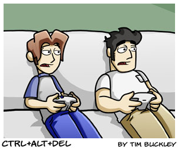

<div align="center"></div>
<div align="center"><small><sup><a href="https://cad-comic.com/comic/that-damned-changeup/">Ctrl+Alt+Del Comic #997: "That damned changeup"</a></sup></small></div>
<h1 align="center">
  <b>webcomic2cbz</b>
</h1>

<h4 align="center">Fetch and package Webcomics into CBZ files (with embedded ComicInfo).</h4>

<p align="center">
  <a href="#status">Status</a> •
  <a href="#usage">Usage</a> •
  <a href="#internals">Internals</a> •
  <a href="#contributing">Contributing</a> •
  <a href="#license">License</a>
</p>

<p align="center">
  <a href="https://github.com/liampulles/webcomic2cbz/releases">
    
  </a>
  
  <a href="https://github.com/liampulles/webcomic2cbz/blob/master/LICENSE.md">
    
  </a>
</p>

## Status

This is alpha software, and mostly designed for my personal needs.

## Usage

`webcomic2cbz` is a CLI program, and works by looking for `webcomic2cbz.yml` files, recursively in the provided dir. Those files provide the instructions for `webcomic2cbz` to then process.

The program can figure out what the latest issue is, download missing images, and package CBZ files in an ongoing fashion.

The combination of these two things means that you can run `webcomic2cbz`
in your comic root directory, and it will automatically sync your webcomics into CBZ files, updating existing ones.

Here is an example `webcomic2cbz.yml` file, for a [Questionable Content](https://questionablecontent.net/) setup:

```yaml
title: Questionable Content
writer: Jeph Jacques
language_iso: en
first_date: 2003-08-01
homepage: https://www.questionablecontent.net/
summary: |
    Questionable Content is an internet  comic strip about friendship, romance, and robots. The world of QC is set in the present day (whenever the present day actually is) and is pretty much the same as our own except there are robots all over the place and giant space stations and the United States wasn't ravaged by a pandemic in 2020 and...okay so there are some differences. But it's not too far off!!! Anyway it's set in Northampton, Massachusetts and follows best buddies Marten and Faye as they navigate life, make friends and forge relationships, and there is definitely some robot smoochin' later on. If the giant archive of  comics intimidates you, don't worry- you can pretty much jump in anywhere and have a general idea of what's going on in a dozen strips or so. If you're looking for what I, THE AUTHOR, would recommend as a good place to start, I'd say 3500 is a pretty good jumping in point for the current state of the  comic.

    Fun facts: QC started on August 1, 2003. There are a whole bunch of horrible alternate URLS you can use to navigate to the comic. ALSO: if you want to get the comics 24 hours before they go live on this website and a bunch of cool BONUS (questionable) CONTENT, you can subscribe to my patreon!

cbz:
    chunk_size: 100
    # (Note that if you change the naming template after making
    #  a few cbz files, they will be ignored in updates. You should
    #  rename the files manually as well).
    naming_template: '{{ .Title }} #{{ printf "%03d" .Volume }}'

source:
    # Ordered list of options, highest is tried first, then it goes to the next option if there are gaps in the sequence and to test for newer issues.
    - imgfiles:
        basename_glob: "*.png"
        basename_format: "{{.Idx}}.png"
        idx_regex: ^([0-9]+)$
    - imgfiles:
        basename_glob: "*.jpg"
        basename_format: "{{.Idx}}.jpg"
        idx_regex: ^([0-9]+)$
    - imgfiles:
        basename_glob: "*.gif"
        basename_format: "{{.Idx}}.gif"
        idx_regex: ^([0-9]+)$
    - httpdirect:
        url_format: https://www.questionablecontent.net/comics/{{.Idx}}.png
        basename_format: "{{.Idx}}.png"
        latest_rule:
          # Match the  element and capture the numeric comic index,
          # regardless of the image file extension.
          homepage_regex: ']+id=["'']strip["''][^>]+src=["''][^"'']*/comics/([0-9]+)\.[^"'']+["'']'
    - httpdirect:
        url_format: https://www.questionablecontent.net/comics/{{.Idx}}.jpg
        basename_format: "{{.Idx}}.jpg"
        latest_rule:
          homepage_regex: ']+id=["'']strip["''][^>]+src=["''][^"'']*/comics/([0-9]+)\.[^"'']+["'']'
    - httpdirect:
        url_format: https://www.questionablecontent.net/comics/{{.Idx}}.gif
        basename_format: "{{.Idx}}.gif"
        latest_rule:
          homepage_regex: ']+id=["'']strip["''][^>]+src=["''][^"'']*/comics/([0-9]+)\.[^"'']+["'']'
```

## Internals

The rough algorithm of the program is as follows:

1. Recursively scan the working directory for `webcomic2cbz.yml` files. Any files we find, we consider the enclosing directory to be a webcomic directory - meaning it contains pertinent CBZ files and source images.
1. Scan for existing CBZ.
  1. Sometimes the CBZ needs to be "undone" here, mainly if you are changing chunk sizes. In that case, we extract its webcomic images and delete the CBZ. Those extracted images can be reused later.
  1. Otherwise, we can ensure the enclosed `ComicInfo.xml` is up to date.
  1. We also track what webcomics the CBZs enclose here.
1. Try and source missing webcomics.
  1. This will go through the config source sections in order, trying to pull as many images as possible for a source before moving to the next.
1. Update existing CBZ for sourced webcomics.
1. Create new CBZ for sourced webcomics.

## Contributing

Please submit an issue with your proposal.

## License

See [LICENSE](LICENSE)